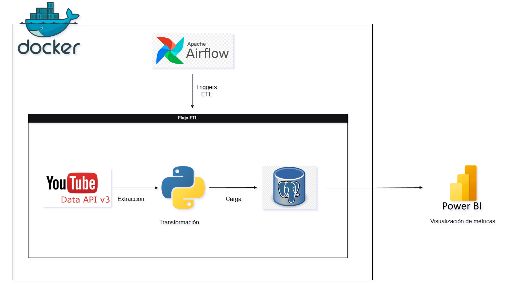

# YouTube ETL – Technology Trends

Proyecto ETL end-to-end para extraer, transformar y almacenar información de videos de YouTube relacionados con tecnologías y lenguajes de programación, con el objetivo de analizar métricas de popularidad y engagement mediante Power BI.

El pipeline está orquestado con Apache Airflow y se ejecuta completamente en contenedores Docker.
El dashboard se actualiza automáticamente a partir de un pipeline ETL que consume la YouTube Data API y almacena los datos en PostgreSQL.

---

## Arquitectura de la solución



---

## Dashboard interactivo

[](https://app.powerbi.com/view?r=eyJrIjoiYzI4MThlNjAtMTQwYS00NjY1LTlkMjYtNDRiNjgxYjA1ZDQ3IiwidCI6IjBlMGNiMDYwLTA5YWQtNDlmNS1hMDA1LTY4YjliNDlhYTFmNiIsImMiOjR9)

---

## Estructura del proyecto

```text
etl-youtube-api/
├── dags/            # DAGs de Airflow
├── scripts/         # Scripts de ejecución del ETL
├── src/             # Código fuente (extract, transform, load)
├── docker-compose.yml
├── Dockerfile
├── requirements.txt
└── README.md
```

---

## Flujo del ETL

1. Airflow ejecuta el DAG
2. Se procesa una tecnología y un año por ejecución
3. Se extraen datos desde la YouTube Data API
4. Se limpian y transforman los datos
5. Se cargan en PostgreSQL
6. Los datos son consumidos desde Power BI

---

## Consideraciones sobre la API de YouTube

La YouTube Data API tiene un límite diario de cuota.  
Para evitar excederlo, el ETL está diseñado para:

- Ejecutar una tecnología por corrida
- Procesar un solo año por ejecución
- Controlar los queries desde base de datos

---

## Ejecución

**Levantar los servicios:**

```bash
docker compose up -d
```

**Interfaz de Airflow:**

```
http://localhost:8080
```

**Ejecución manual (opcional):**

```bash
docker exec -it etl-youtube-api-airflow-scheduler-1 \
python /opt/airflow/scripts/run_etl.py PY
```

---

## Tecnologías utilizadas

- Python
- Apache Airflow
- Docker
- PostgreSQL
- YouTube Data API
- Power BI

---

## Autor

**Jamir Marzal**  
Estudiante de Ingeniería de Software 
Enfoque en Data Engineering